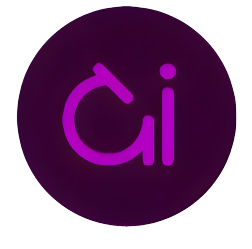

Este proyecto es una aplicación web sobre un Centro de Pathología.

    
    <h1>Dig Patho</h1>
    

    Somos una startup de Inteligencia Artificial e imágenes para Medicina. Nuestro objetivo es detectar cáncer de la manera más rápida y eficiente, así como disminuir la carga de trabajo de los patólogos e invadir a los pacientes en menor medida. El proyecto busca ser tan abierto como una universidad y tan sofisticado como un negocio health-tech.
     
    <a href='https://digpatho.netlify.app/'>
    <strong>Explorar pagina » </strong>
    </a>
     
     
    <a href='https://digpatho.netlify.app/'>
    Reportar un problema
    </a>
    ·
    <a href='https://digpatho.netlify.app/'>
    Solicitar una mejora
    </a>
    ·
    <a href='https://digpatho.netlify.app/'>
    Soporte
    </a>
    

## Aplicación Web con React y Vite

Esta aplicación realizada en forma individual para el test para la bacanque de desarrollo en digPatho .

## Enunciado - Requerimientos

Página principal:
   * Descripcion corta sobre la emprese y acceso a su web principal.

Navbar:
   * Logo de la empresa.
   * Botón de login.

Footer:
   * Redes sociales del gimnasio.
   * Ubicación.
   * Teléfonos.
   * Información adicional.

Login:
   * Página o ventana modal.
   * Permitir login de al menos el administrador.
   * Contraseña del administrador encriptada usando bcryptjs.

Administrar Usuarios:
   * Nombre.
   * Apellido.
   * Email.

Páginas Informativas:

Página de contacto:
   * Formulario completamente validado.

## Deploy de la aplicación

La aplicación está desplegada en Netlify. Puedes acceder haciendo clic en el siguiente enlace:

🔗 [DigPatho](https://digpatho.netlify.app/)

## Repositorio Backend

* #### Repositorio Backend: [backendDigPatho]( Repositorio Backend: [backendProyectoFinal](https://github.com/PRADON1CO/digPatho-Backend))

## Tecnologías utilizadas

  
  
  
  
  
  
  
  

  * ### Otras:

    - [React-Router-Dom](https://reactrouter.com/en/main/start/tutorial) 
    - [React-Hook-Form](https://react-hook-form.com/get-started)
    - [SweetAlert2](https://sweetalert2.github.io/#download)
    - [Json-server](https://github.com/typicode/json-server)

## Requisitos previos

- Node.js instalado en tu sistema. Puedes descargarlo [aquí](https://nodejs.org/).

## Instalacion y uso

1. Clona este repositorio en tu máquina local a través de una terminal:

  * git clone <[url-del-repositorio](https://github.com/PRADON1CO/digPatho-Front)>

2. Navega al directorio del proyecto:

  * cd ProyectoFinalRC-Front

3. Instala las dependencias del proyecto:

  * npm install o npm i

4. Crear un archivo .env y agregar la variable:
  *VITE_API_USUARIO= url

## Autores

_Prado brian Nicolas_

- Github: https://github.com/PRADON1CO

## 📞 Contactanos

| Medio    | Link                                   |
| -------- | -------------------------------------- |
| Email    | digPatho@gmail.com                   |
| Twitter  | https://twitter.com/digPatho         |
| Linkedin | https://www.linkedin.com/in/digPatho |

## Licencia

codigo y documentacion copyright 2023-2024 de los autores de Dig Patho

